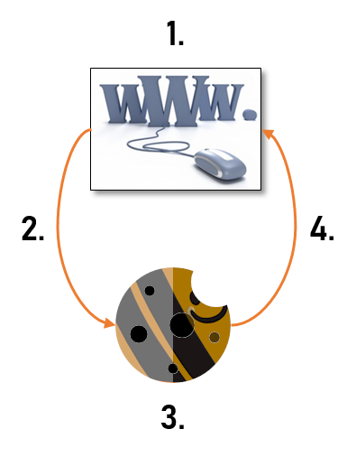

# XcooBee Cookie Kit

## What is the XCK

The objective of the XcooBee Cookie Kit (XCK) is to enable websites to manage their Cookie consent more effectively and with less annoyance to their users. The XCK can work in concert with the XcooBee network to improve overall management for users and businesses but that is not required. When the XCK works independently of XcooBee some management functionality will not be available.

The XCK makes it easy to plugin cookie consent into your website. It handles all user interaction to obtain consent and lets the website know which cookies can be used for each users while they visit your website. Similarly, your website can now be informed when users change their consent even when they are not visiting it.

THe XCK is one of the most transparent and frictionless ways to manage cookies on your site. It will not pop-up, in, or otherwise hinder the user experience when it is not needed. Yet, at the same time, it provides full compliance with European e-directives and related GDPR rules. 

Website owners can easily react to data-requests, and report on privacy related requests if needed via the XcooBee network.

The XCK does not require a XcooBee connection to work for your website. You will still have access to the majority of user consent gathering but will not have central insight and consent management.


## How does this Work

The XCK operates in two modes. One, in disconnected mode, where the XCK and your website interact directly without the use of any other service. Two, in connected mode, where XCK interacts with the XcooBee network to allow companies to document and manage cookie consent while giving users additional tools to manage and simplify cookie handling.

In the following we explain how each mode works.

### Disconnected Mode



In disconnected mode, 
1. your web site loads and renders its content without setting cookies
2. loads the XCK with your parameters
3. the XCK handles user interaction for cookie consent
4. communicates back to your site which cookie types can be set.

Your site, then, sets the cookies according to user preferences.


### Connected Mode


The connected mode is similar in process with differences in each step to reflect additional tools:

In connected mode, 
1. your web site loads and renders its content without setting cookies
2. loads the XCK with your parameters including your campaign references
3. the XCK handles user interaction for cookie consent. For XcooBee users the XCK transparently negotiates with your site based on user preferences. XcooBee users can surf sites with little interruption.
4. XCK communicates back to your site which cookie types can be set.

Your site, then, sets the cookies according to user preferences.

5. As site owner, you can review all managed cookie consent. Report on compliance issues, take action when users' change their consent even when not visiting your site. Your site visitors (users) can actively manage cookie consent centrally, and transparently surf your site without annoying pop-ups.

## Install

You activate the XCK by embedding it into your site via `<script>` tags. In addition, during invocation you provide additional parameters to the script tag.

Some of these include:

- position of the hover button
- terms url
- cookie policy url
- expiration time for the widget
- text message
- cookie handling function
- site defaults
- target Url

When you subscribe to XcooBee you can also specify:

- your campaign reference
- company logo
- cssAutoLoad

A `campaignId` is needed for the XCK to communicate with XcooBee and allow management of consents. Please visit [XcooBee](https://www.xcoobee.com) if you need to create an account. Without it the XCK will work in offline mode.


## Initialization Parameters

The XCK is initialized with a set of parameters that determine the behavior of the XCK on your site. This can include rendering location, timeouts, event handlers, css etc.

The following is a list of parameters the XCK can process:

### checkByDefaultTypes

This is an array of strings of cookie types used on your sites by default. This is one or more of [application|usage|statistics|advertising]. The default is empty array.

Example:

```json
  checkByDefaultTypes: ["application"]
```

### cookieHandler

If you are using a single page application or a JavaScript based solution for setting cookies you need to specify a cookie handler function, e.g.  `handleCookies(<object>)`. The XCK will call this function with the user's preferences or defaults as needed. This function should either remove or set the cookies based on the categories allowed by user.

This is related to `targetUrl`. One of `cookieHandler` or `targetUrl` is required to be specified for XCK to start.

See more information in section `How to Use the XcooBee Cookie Kit` in this document.

```json
cookieHandler: handleCookies
```

### expirationTime `integer`

This is the time in seconds we will display the floating cookie icon. After the expiration time has been reached the floating cookie icon will be removed from display. This time resets every time the icon is clicked and a pop-up dialog is displayed.

When set to zero, the icon will not be removed.

Defaults to zero.

```json
expirationTime: 0

```

### position `list`

The position parameter is one of [left_bottom|left_top|right_bottom|right_top] and indicates the position from which the XCK displays its window or floating cookie icon. Default: left_bottom

```
position: "left_bottom"
```

### privacyUrl `string` `required`

This is the page the user will be directed to to review your Privacy Policy. The cookie kit will not start without data for Privacy Policy.

```json
termsUrl: "https://mysite.com/privacy"
```

### requestDataTypes
 This is an array of strings of cookie types used on your sites for which you wish to obtain the users' consent before creating. This is one or more of [application|usage|statistics|advertising]. The default is `application`.

 ```json
  requestDataTypes: ["application"]
```

### targetUrl `string`

If you are using Request/Response technology based site, for example PHP, JSP, CFML and you set the cookies in your code, the XCK will make a call via HTTP GET to the targetUrl you specify and a URL parameter payload with the user's preferences for cookies. 

You will, then, need to set them accordingly. We encourage the use of HTTPS/TLS connections to ensure proper security.

This is related to `cookieHandler`. One of `cookieHandler` or `targetUrl` is required to be specified for XCK to start.

See more information in section `How to Use the XcooBee Cookie Kit` in this document.

```json
targetUrl: "https://mysite.com/setCookies"
```


### termsUrl `string` `required`

This is the page the user will be directed to to review your Terms of Service. The cookie kit will not start without valid terms of service.

```json
termsUrl: "https://mysite.com/terms"
```

### textMessage `string` `required`

This is the message we will display to the user when asking for cookie preferences. This message can be formatted as string or as JSON. When using JSON you can specify the message in different languages. The XCK will make an attempt to determine the default language based on browser settings and fallback to US English if it cannot make a determination. The cookie kit will not start without a consent message to display to users.

Example of text entry in single language:

```json
textMessage: "This site uses cookies. Please select the cookie types that you wish to use and then click OK"

```

Example of text entry in multiple languages:

```json
{
  "en-us": "English text",
  "de-de": "German text",
  "es-419": "Spanish text",
  "fr-fr": "French text",
}
```

### displayOnlyForEU `boolean`

This lets the XCK know to do quick evaluation of the call context for the XCK if the users are outside the EU. If the XCK determines that it is being loaded outside the EU (28 nation block) and there are no user defaults or other guidance, the XCK can automatically apply company standard cookies using the `checkByDefaultTypes` setting. When doing so it will inform the user by pulsing red. The visiting user can still change the decisions at any time.


## Initialization Parameters with XcooBee subscription

### campaignReference

This connects your campaignId to the XCK. The XcooBee campaign wizard will generate it for you.

### companyLogo

The XCK can display your company logo. Your cookie campaign options will have the ability to upload a logo and will make available to the XCK.
This parameter is only available when subscripting to XcooBee.

### CSS override 

If you wish to use your own CSS, the XcooBee code generator will set this based on your selection for your Cookie Campaign. Your campaign wizard will guide you through the process.


**IMPORTANT**

Your campaign name in the XcooBee campaign console needs to match your domain name (first part of the URL) for which you are using the cookie kit. If this is not the case, you will have errors returned from the XcooBee network.

For example if your site runs on this url "http://www.mysite.com/product/hello" the domain is `www.mysite.com`. This has to be your campaign name in XcooBee.


## Program Hooks


You can use public methods of the XCK to set and retrieve parameter information. These are found under the `XcooBee.kit` object.

### setParam([parameter], [value])

Use the `setParam()` method to set any valid parameter for the XCK. For example to set the targetUrl parameter to a different value. Where `parameter [string]` is any of the valid parameters, and `value [any]` is data for the parameter.

```JavaScript

XcooBee.kit.setParam("targetUrl","https://newsite.com/cookieProcessor");

```

If you are using a cookieHandler JavaScript function that is not exposed in global scope, you will need to let the XCK know via a setParam call. You should do this after loading the XCK and before calling `XcooBee.kit.initialize()`. 

```JavaScript

XcooBee.kit.setParam("cookieHandler", myCookieHandlerFunction);

```

Alternately, you can initialize with correct function reference.

```HTML
<script type="text/javascript">
  XcooBee.kit.initialize({
    requestDataTypes: ["application","usage"],
    checkByDefaultTypes: ["application"],
    cookieHandler: myCookieHandlerFunction,    
   ...
  });
</script>
```

### getParam([parameter]) `object`

Retrieves the value of actively used parameter from the XCK.

Example:

```JavaScript

let termsSite = XcooBee.kit.getParam("termsUrl");

```

### getConsentStatus() `string`

Returns the current status of the XCK interaction with the user. Current this is one of [open|complete|closed].

`open` => user is being asked for consent at the moment

`complete` => we have received consent information from user

`closed` => the user did not respond and the cookie consent has expired after `expirationTime`


```JavaScript

let consentStatus = XcooBee.kit.getConsentStatus();

```

### getCookieTypes() `object`

This returns the users' decision regarding the consent for each cookie type. It will always return a full object with all types or empty object `{}`.
Only available after `getConsentStatus() = "complete"` If you call this before we have an answer from user we will return an empty object.


Example call:

```JavaScript

let cookieTypeStatus = XcooBee.kit.getCookieTypes();

```

Example return object:

```json
{
  "application": true,
  "usage": true,
  "statistics": false,
  "advertising": false 
}

```


## Examples of script tag

You will embed/install the XCK via added a script tag to your site. Here is an example of what this could look like.

You need to place this in the HTML of your site in between `<head>` and `<body>` tags. We suggest this as last script element.


```javascript
<script type="text/javascript" id="xcoobee-cookie-kit" src="https://app.xcoobee.net/xcoobee-cookie-kit.min.js"></script>
<script type="text/javascript">
  XcooBee.kit.initialize({
    requestDataTypes: ["application","usage"],
    checkByDefaultTypes: ["application"],
    cookieHandler: myCookieHandler,    
    expirationTime: 0,
    position: "left_bottom",
    privacyUrl: "https://mysite.com/privacy",        
    termsUrl: "https://mysite.com/terms",    
    textMessage: "This site uses cookies to make your experience better. Please let us know which type of cookies we may use."
  });
</script>
```


Here is an example of options and values for the initialization:

```javascript
<script type="text/javascript" id="xcoobee-cookie-kit" src="{URL}/xcoobee-cookie-kit.min.js"></script>
<script type="text/javascript">
  XcooBee.kit.initialize({
    campaignReference: <String>,    
    checkByDefaultTypes: <Array>[application|usage|statistics|advertising]    
    cookieHandler: <Function>,    
    expirationTime: <Number> (in seconds),
    position: <String> ("left_bottom", "left_top", "right_bottom", "right_top"),
    privacyUrl: <String>,
    requestDataTypes: <Array>[application|usage|statistics|advertising],
    targetUrl: <String>,
    termsUrl: <String>,
    testMode: <Boolean>,
    textMessage: <String>, <JSON>
  });
</script>
```


## CSS Reference

<link rel="stylesheet" href="{URL}/xcoobee-cookie-kit.min.css">

All of the display elements can be overridden, however, we can not support non-standard CSS values.

# How to Use the XcooBee Cookie Kit

## How to use Cookie Kit in Single Page Application (SPA)

When using a SPA you can specify a JavaScript handler that can receive the result of the user interaction for cookie consent. Thereafter you need to load the scripts and/or set the cookies directly based on the user's interaction.

Since this can change, you also need to be able to remove the cookies when users change their mind.

In both cases, the XCK will invoke your handler function after the user has completed their interaction with XCK.

XCK will call target handler with JSON object as function parameter. Users preferences are in the first function argument.

The function argument object will be a JS Object.

Example JS object:

```json
{
  "application": true,
  "usage": true,
  "statistics": false,
  "advertising": false 
}

```

Thus the call signature will be: `handlerFunction(cookieObject)`.

For example if your handler function is named `cookieHandler` and the  object is named `userCookiePreferences` this would be the call:

```JavaScript

  cookieHandler(userCookiePreferences);

```

Sample cookieHandler function:

```JavaScript

function cookieHandler(cookieObject) {
    if (cookieObject.application) {
      // set required cookies here
      // ...
    } else {
      // remove required cookie here
      // ...
    };

    if (cookieObject.usage) {
      // set user personalization cookies here
      // ...
    } else {
      // remove user personalization cookies here
      // ...
    };

    if (cookieObject.statistics) {
      // set site statistics gathering cookies here
      // ...
    } else {
      // remove site statistics gathering cookies here
      // ...
    };

    if (cookieObject.advertising) {
      // set advertising and marketing and tracking cookies here
      // ...
    } else {
      // remove advertising and marketing and tracking cookies here
      // ...
    };
}

```


## How to use Cookie Kit with Request/Response systems like PHP, JSP, .net, CFML etc.

The XCK can communicate users' grant and removal of consent for cookies to your site via webhook post (HTTP POST) as well. You will need an web accessible endpoint as defined by `targetUrl` that can process these messages and set/unset the cookies by cookie type.

The HTTP POST will be using `CONTENT-TYPE` = `application/json`

The body content is a JSON object with the user selection of cookie types. Only the cookie types for which you have asked for consent will be included.

```JSON
{
  "time": "Wed, 31 Oct 2018 16:40:28 GMT",
  "code": 200,
  "result": {
    "application": true,
    "usage": false,
    "statistics": true
  }
}
```

Where:

```
time => date of the decision in UTC
code => 200 for success
result => the JSON with information about cookie types
```


## How use the XCK with XcooBee subscription and high security data exchange

When you have a XcooBee subscription your website can also receive updates regarding the granted consent when the user if not directly online via the XcooBee network. This communication will occur through webhooks and higher level of encryption. 

As an alternative to direct HTTP POST, your subscription to the XcooBee network also allows event polling so you can use the XCK for sites that are not directly accessible via the internet, i.e. intranet sites or sites under development.

You need to be able to process messages from XcooBee that are using PGP encryption on top of HTTPS/TLS. 
The message pattern is the same as described previous section. 

You can use one of the XcooBee SDKs for simplifying this interaction:

- [XcooBee JavaScript SDK](https://github.com/XcooBee/xcoobee-js-sdk)
- [XcooBee PHP SDK](https://github.com/XcooBee/xcoobee-php-sdk)

The use of the XcooBee network is not a required interaction. Users will transparently update their cookie preferences with your site every time they visit. 

